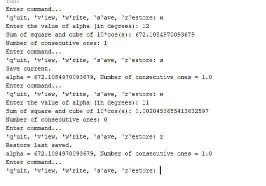
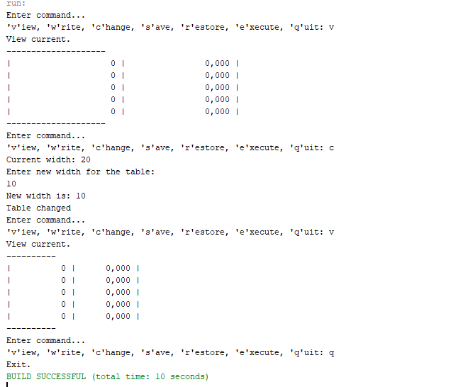
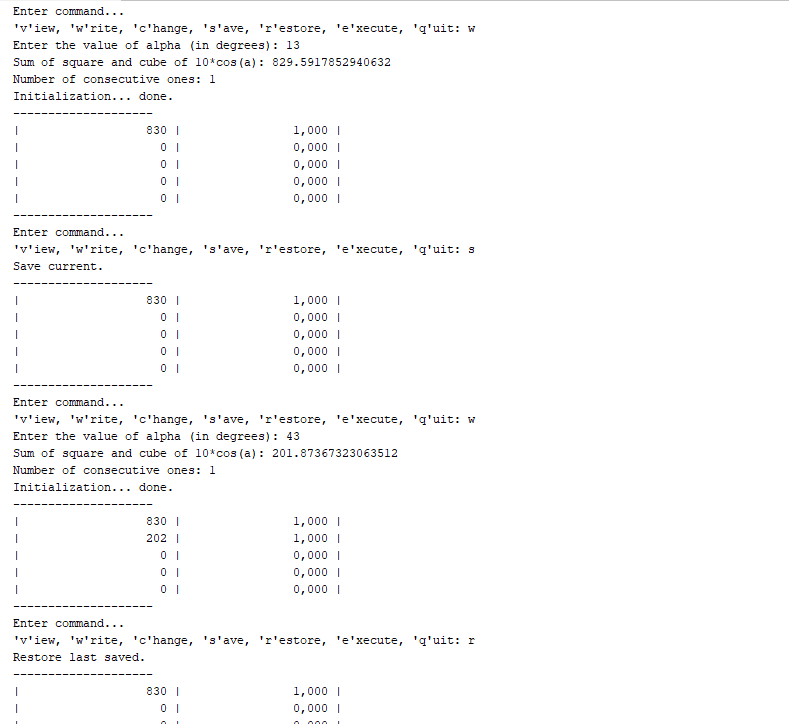
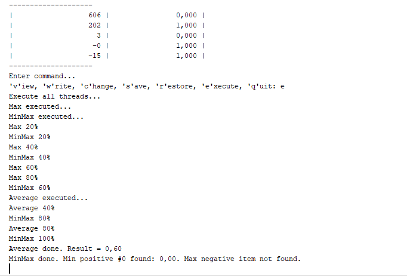

# OOP_Practice
[Завдання 1](Start)

*1. Підготувати сховище до розміщення проекту*

*2. Написати просту консольну програму (наприклад вивід на екран аргументів командної строки)*

*3. Прикріпити посилання на GIT та архівований проект*

# У мене виникли деякі проблеми з JUnit тестуванням, тому зараз просто робочі задачі, а про тести буду питати завтра

### Основне завдання:  Визначити найбільшу довжину послідовності 1 в подвійному поданні цілісної суми квадрата і куба 10*cos(α).

[Завдання 2](Tasks/ex01)

*1. Розробити клас, що серіалізується, для зберігання параметрів і результатів обчислень. Використовуючи агрегування, розробити клас для знаходження рішення задачі.*

*2. Розробити клас для демонстрації в діалоговому режимі збереження та відновлення стану об'єкта, використовуючи серіалізацію. Показати особливості використання transient полів.*

*3. Розробити клас для тестування коректності результатів обчислень та серіалізації/десеріалізації. Використовувати докладні коментарі для автоматичної генерації документації засобами javadoc.*

Результат:

[Завдання 3](Tasks/ex02)

*1. Як основа використовувати вихідний текст проекту попередньої лабораторної роботи. Забезпечити розміщення результатів обчислень у колекції з можливістю збереження/відновлення.*

*2. Використовуючи шаблон проектування Factory Method (Virtual Constructor), розробити ієрархію, що передбачає розширення за рахунок додавання нових відображуваних класів.*

*3. Розширити ієрархію інтерфейсом "фабрикованих" об'єктів, що представляє набір методів для відображення результатів обчислень.*

*4. Реалізувати ці методи виведення результатів у текстовому виде.*

*5. Розробити та реалізувати інтерфейс для "фабрикуючого" методу*

Результат:

(Колекція почала правильно заповнюватись тільки при виконанні наступного завдання, тому тут такий результат. Далі все працює коректно)

[Завдання 4](Tasks/ex03)

*1.За основу використовувати вихідний текст проекту попередньої лабораторної роботи Використовуючи шаблон проектування Factory Method (Virtual Constructor), розширити ієрархію похідними класами, реалізують методи для подання результатів у вигляді текстової таблиці. Параметри відображення таблиці мають визначатися користувачем.*

*2.Продемонструвати заміщення (перевизначення, overriding), поєднання (перевантаження, overloading), динамічне призначення методів (Пізнє зв'язування, поліморфізм, dynamic method dispatch).*

*3. Забезпечити діалоговий інтерфейс із користувачем.*

*4. Розробити клас для тестування основної функціональності.*

*5. Використати коментарі для автоматичної генерації документації засобами javadoc.*

Результат:

[Завдання 5](Tasks/ex04)

*1. Реалізувати можливість скасування (undo) операцій (команд).*

*2. Продемонструвати поняття "макрокоманда"*

*3.При розробці програми використовувати шаблон Singletone.*

*4. Забезпечити діалоговий інтерфейс із користувачем.*

*5.Розробити клас для тестування функціональності програми.*

Результат:

[Завдання 6](Tasks/ex05)

*1.Продемонструвати можливість паралельної обробки елементів колекції (пошук мінімуму, максимуму, обчислення середнього значення, відбір за критерієм, статистична обробка тощо).*

*2. Управління чергою завдань (команд) реалізувати за допомогою шаблону Worker Thread.*

Результат:

(Така проблема, у вас в коді коллекція генерується з випадковим ходом аргументу, а у мене аргумент чітко заданий, і я не знаю як змінити код так, щоб коллекція не забивалась одним результатом повністью, а потім командою "save" повністью сереалізувалась, а вносила результат в один з її елементів і поступово заповнювалась командами "write")
